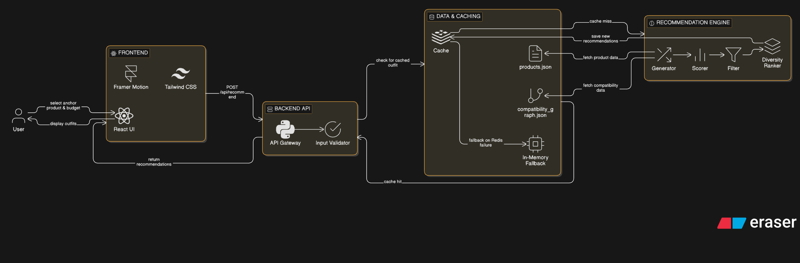

# Outfit Recommendation Engine

## Project Overview
A FastAPI-backed outfit recommender with a Vite/React frontend. It turns a chosen base product into a cohesive four-item outfit (top, bottom, footwear, accessory) using a precomputed compatibility graph, lightweight heuristics, and caching to return results in under a second.

## System Architecture




## Architecture Explanation
- **Backend**: FastAPI service ([app/main.py](app/main.py)) exposing `/recommendations/outfit`. Core logic lives in [app/engine/generator.py](app/engine/generator.py), [app/engine/scorer.py](app/engine/scorer.py), and supporting helpers.
- **Data**: In-memory JSON datasets loaded at startup ([app/data/products.json](app/data/products.json), [app/data/compatibility_graph.json](app/data/compatibility_graph.json)). Scripts in [scripts/](scripts) build these from CSVs.
- **Caching**: Dual-layer cache: Redis if available ([app/cache/redis_cache.py](app/cache/redis_cache.py)) and per-process memory fallback ([app/cache/memory.py](app/cache/memory.py)).
- **Frontend**: React + Vite app in [outfit-recommendation-frontend/](outfit-recommendation-frontend) calling the API and rendering outfits.
- **Flow**: Client POST -> FastAPI router ([app/api/recommend.py](app/api/recommend.py)) -> generator builds candidates -> scorer ranks -> diversity pass -> response cached and returned.

## Recommendation Logic
- **Input**: `base_product_id`, optional `occasion` (default `casual`), `budget_tier` (`low|mid|high`, default `mid`).
- **Generation**: Pre-split products by category, lock the base item into its category, and limit search space via hard caps and shuffling ([app/engine/generator.py](app/engine/generator.py)). Uses the compatibility graph to ensure only linked items combine; non-shoe footwear is filtered with `is_valid_footwear` guard.
- **Scoring**: `score_outfit` blends color/style/occasion/season scores plus a budget alignment term and small accessory bonus ([app/engine/scorer.py](app/engine/scorer.py)).
- **Diversity**: Results are sorted by score then de-duplicated for variety using `diversify` to avoid near-identical outfits ([app/engine/diversity.py](app/engine/diversity.py)).
- **Guards**: Accessories cannot anchor outfits; invalid bases return empty results with a note. Hard time cap prevents overruns.

## Performance Strategy (sub-1s)
- Load all product and graph data once at startup to avoid I/O per request.
- Limit candidate pool per category and total outfits (`MAX_PER_CATEGORY`, `MAX_OUTFITS`) and enforce a ~0.6s cutoff in generation.
- Fast heuristic scoring (no external calls) keeps compute O(n) on capped pools.
- Dual caching: Redis for cross-process reuse, in-memory fallback for single-process hits; cache key is `base:occasion:budget`.
- CORS-pre-enabled; single network hop from frontend to backend minimizes latency.

## AI Usage
No external AI/ML models or APIs are used. The system relies on rule-based compatibility, a precomputed graph, and heuristic scoring. If adding ML later, swap scoring with a learned model while keeping the existing API.

## How to Run
### Backend (FastAPI)
1) Create env & install deps
```
python -m venv .venv
.venv\Scripts\activate
pip install -r requirements.txt
```
2) Start API
```
uvicorn app.main:app --reload --host 0.0.0.0 --port 8000
```

### Frontend (React)
```
cd outfit-recommendation-frontend
npm install
npm run dev
```
Vite dev server runs at http://localhost:5173 (CORS allowed).

### Sample Request
```
curl -X POST http://localhost:8000/recommendations/outfit \
  -H "Content-Type: application/json" \
  -d '{"base_product_id":"top_01","occasion":"casual","budget_tier":"mid"}'
```

### Sample Response (shape)
```json
{
  "base_product": "top_01",
  "outfits": [
    {
      "items": {
        "top": "top_01",
        "bottom": "bottom_03",
        "footwear": "shoe_05",
        "accessory": "acc_02"
      },
      "match_score": 0.87,
      "reasoning": {
        "summary": "Casual streetwear outfit built around the selected product, balanced for daily wear and budget awareness.",
        "style": ["street"],
        "occasion": "casual",
        "season": ["summer"],
        "budget": {"tier": "mid", "total_price": 6800}
      },
      "latency_ms": 142.6
    }
  ]
}
```

## Assumptions & Trade-offs
- Dataset is curated; compatibility graph is precomputed and trusted. Adding new products requires regenerating the graph via [scripts/](scripts).
- Heuristic scoring favors speed over deep semantics; no color embedding or CV model is used.
- Budget tiers are coarse; could expand to per-country pricing or discounts.
- Diversity is simple; could add user history or novelty penalties.
- Redis is optional; when absent, caching is per-process only. Use a managed Redis for scale.
- Error handling is minimal; invalid base IDs return a terse error. Future: validation and richer messages.
